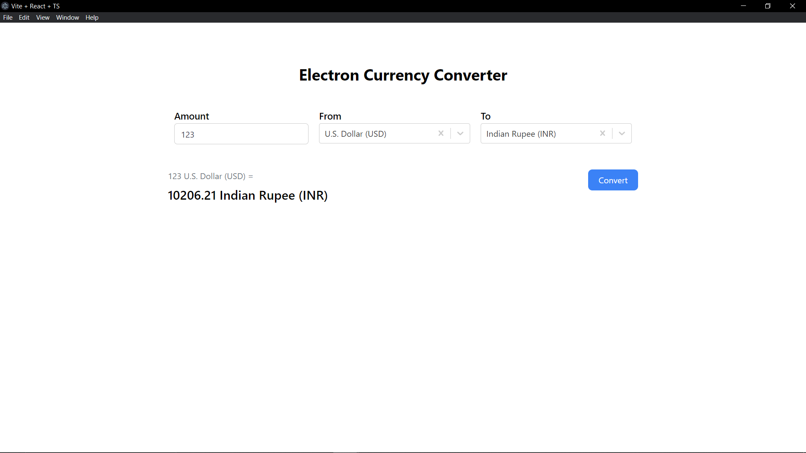

# Electron Currency Converter

## Overview

This is a simple desktop application built using Electron.js and Vite with React for currency conversion. It allows you to select currencies, enter an amount, and convert it to the selected currency.

## Features

- Dropdowns for selecting 'From' and 'To' currencies.
- Input field for entering the amount.
- A button to initiate the currency conversion.
- Display of the converted currency value.

## Setup Instructions

To get this Electron Currency Converter up and running on your local machine, follow these steps:

### 1. Install PNPM (if not installed)

Make sure you have [PNPM](https://pnpm.io/) installed on your system. If not, you can install it using npm (Node Package Manager) as follows:

```bash
npm install -g pnpm
```

### 2. Clone the repository
Clone this repository to your local machine:

```bash
git clone https://github.com/yash8202/electron-currency-converter.git
```
### 3. Navigate to the project directory
Change your current working directory to the project directory:

```bash
cd electron-currency-converter
```

### 4. Install dependencies
Install the dependencies in the local node_modules folder:

```bash
pnpm install
```

### 5. Environment variables
Go to [ExchangeRate-API](https://www.exchangerate-api.com/) and create an account to get your API key. Then, create a `.env.local` file in the project directory and add the following line to it:

```bash
VITE_API_KEY=YOUR_API_KEY
```


### 6. Run the application
Run the application in development mode:

```bash
pnpm dev
```

This will start the application in development mode. You can now make changes to the code and the application will reload with the changes.

### 7. Build the application
Build the application for production:

```bash
pnpm build
```

This will build the application for production and create a `dist` folder in the project directory.


## Screenshots




## Credits
- Build with [Electron.js](https://www.electronjs.org/)
- Bundled with [Vite](https://vitejs.dev/)
- Bootstrapped with [electron-vite](https://electron-vite.github.io/)